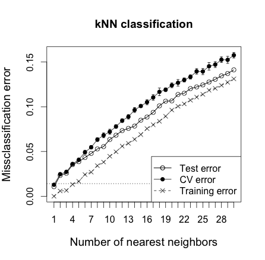

This is an R Markdown document for course project.

Befor the analysis process, the provided data need to be cleaned because there were lots of useless and invalid items.
#### Data import
The training and validation data were imported into the training variable, and the testing variable stores the problems 1 to 20. As well, the necessary packages should be annouced.

```{r}
library(caret)
library(class)
library(chemometrics)
training <- read.csv("pml-training.csv")
testing <- read.csv("pml-testing.csv")
```

#### Data clean
There were lots of NAs and empty value in the data set, which can be seen by
```{r, eval=FALSE}
summary(training)
```
I proposed two functions to get the column numbers with lots of NAs or empty values: proc and proc1 
```{r}

proc <- function(x){
        y <- NULL
        a <- NULL
        for(i in 1:length(x))
        {
                a <- summary(x[,i])[7]
                if(is.na(a)==FALSE){
                        if((a>19215)==TRUE){y <- cbind(y,i)}
                }
        }
        return(y)
}
```

```{r}
proc2 <- function(x){
        y <- NULL
        b <- NULL
        for(i in 1:length(x))
        {
                b <- summary(x[,i])[1]
                if(names(b)==""){
                        if((b==19216)==TRUE){y <- cbind(y,i)}
                }
        }
        return(y)
}
```

These colums were removed by the codes:
```{r}
t <- cbind(proc(training), proc2(training))
work <- training
work <- work[,-t]
inTrain <- work[,c(-1,-2,-3,-4,-5,-6,-7)]
```

#### kNN model
We proposed a kNN model, the data were normorlized by setting the preProcess method:

```{r, eval=FALSE}
#The training process needs lot of time (about 1 hour), so it would not be evaluated.
modelFit <- train(classe ~., method="knn", preProcess = c("center", "scale"),
                  data=inTrain, tuneLength = 10, trControl = trainControl(method = "boot"))
```
Use the code 
```{r}
modelFit$finalModel
```
and the model were:
```{r}
#5-nearest neighbor classification model

#Call:
#knn3.matrix(x = as.matrix(x), y = y, k = param$k)

#Training set class distribution:

#   A    B    C    D    E 
#5580 3797 3422 3216 3607 
```
and the results were:
```{r}
#  k  Accuracy     Kappa  AccuracySD     KappaSD
#1   5 0.9637103 0.9540862 0.001824598 0.002278287
#2   7 0.9562568 0.9446472 0.002725591 0.003425858
#3   9 0.9475822 0.9336653 0.002575831 0.003237068
#4  11 0.9406916 0.9249365 0.002717190 0.003411679
#5  13 0.9333558 0.9156488 0.003299777 0.004157151
#6  15 0.9262877 0.9066970 0.003753407 0.004726244
#7  17 0.9197137 0.8983746 0.003810725 0.004800506
#8  19 0.9135285 0.8905438 0.004497661 0.005670446
#9  21 0.9076967 0.8831617 0.004349300 0.005465799
#10 23 0.9023769 0.8764211 0.004448119 0.005584917
```
We can see that the accuracy for the model with 5 nearest neighbours were 96.37%.
#### Cross Validation
```{r, eval=FALSE}
#Still takes long time
scaleinTrain = scale(inTrain[,1:52])
n = nrow(inTrain)
ntrain = round(n*2/3)
set.seed(123)
train = sample(1:n, ntrain)
resknn=knnEval(scaleinTrain, inTrain$classe, train, knnvec=seq(1,30,by=1), legpos="bottomright")
title("kNN classification")
```
The result with the code was:


